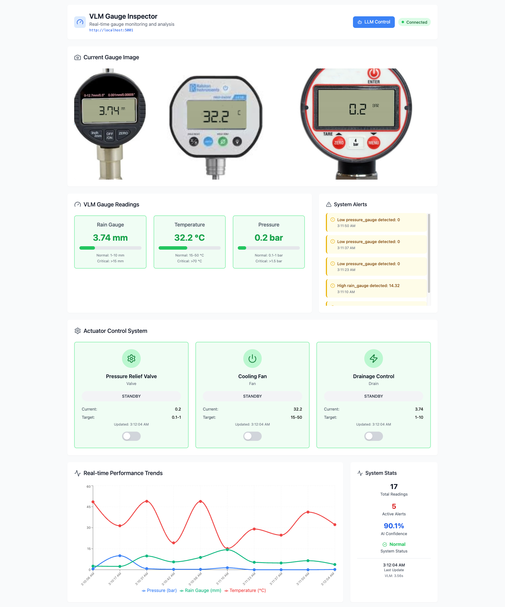
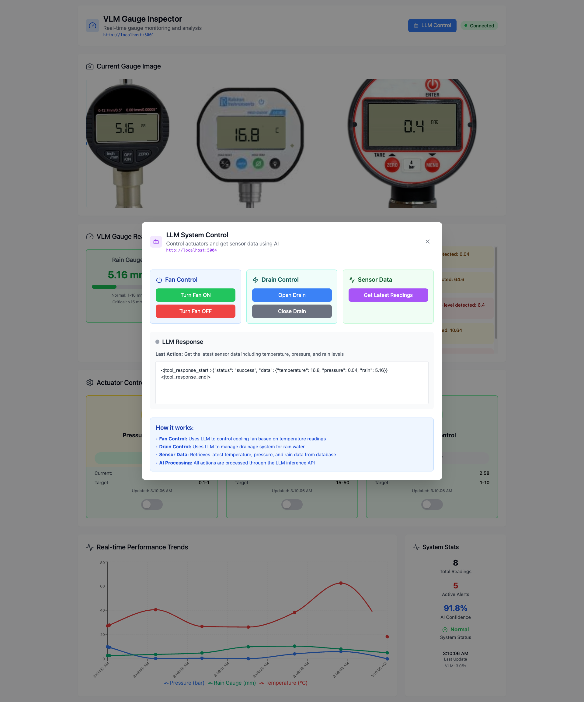

# Liquid AI Competition Smart Guage System 
Smart Gauge System is a project that uses computer vision with LM (Language Models) capabilities to monitor gauges, read sensor data, and control external devices (e.g. fan) through a combined backend + frontend system. Designed for edge deployment (e.g. Jetson) as well as local development.

### Features
- Vision‐based gauge reading (using LFM2-VL-450M)
- Tool calling to fetch sensor data from database (e.g. LFM2-350M)
- Ability to control hardware (fan) via tool calls
- Supports local development and deployment on Jetson / edge devices

Demo: [Video 1](?) [Video 2](?)

### Using Vision Capabilities to Inspector Guages (LFM2-VL-450M)


### Using Tool Calling to get sensor reading from database(LFM2-350M)


### Using Tool Calling to control Fan (LFM2-350M)

## How to run the Application

### Backend

- Create a virtualenv or conda env 

```
conda create --name vlmenv python=3.10
```
- Activate environment
```
conda activate vlmenv
```

- Install the dependencies
```
pip install  -r requirements.txt
```

- Start the Guage Inspector VLM
```
python3 app-vlm-inference.py
```

- Start the Guage Inspector LLM (In another terminal with the same environment)
```
python3 app-llm-inference.py
```

### Frontend 
Install Node.js and npm
Make sure you have Node.js (which includes npm) installed on your machine.

- Navigate to the project directory: 
```
cd vlm-instaector 
```

- Install the dependencies: 
```
npm install 
```

- Run the development server: 
```
npm run dev 
```

- Open the app in your browser. The terminal will show a local URL. By default, it’s usually:
```
http://localhost:5173/
```

- Refresh if needed: If the app doesn’t load immediately, try refreshing the page in your browser.


## Optional: Jetson / Edge Setup

If using Jetson or similar edge hardware:

- Use vlm_processor_jetson.py for hardware‐specific optimizations
- Verify any special dependencies (e.g. CUDA, camera drivers)
- Adjust configuration / paths as needed

## TODO 
- update video 
- install on jetson (check the vlm_processor_jetson)
- Add dataset samples